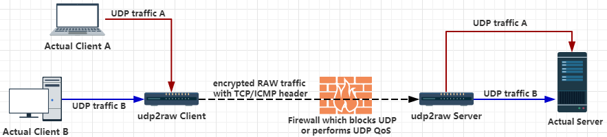

# VQ - Advanced UDP Tunneling Solution


یک تونل که ترافیک UDP را به ترافیک FakeTCP/UDP/ICMP رمزگذاری شده تبدیل می‌کند با استفاده از Raw Socket، به شما کمک می‌کند تا از فایروال‌های UDP عبور کنید (یا در محیط‌های UDP ناپایدار کار کنید).

وقتی به تنهایی استفاده می‌شود، VQ فقط ترافیک UDP را تونل می‌کند. با این حال، اگر VQ را همراه با هر VPN مبتنی بر UDP استفاده کنید، می‌توانید هر نوع ترافیکی (شامل TCP/UDP/ICMP) را تونل کنید. در حال حاضر OpenVPN/L2TP/ShadowVPN و [tinyfecVPN](https://github.com/wangyu-/tinyfecVPN) به طور قطع پشتیبانی می‌شوند.




یا


# پلتفرم‌های پشتیبانی شده
سیستم لینوکس (شامل لینوکس دسکتاپ، گوشی/تبلت اندروید، روتر OpenWRT یا Raspberry PI) با دسترسی root یا قابلیت cap_net_raw.

ویندوز و مک‌او‌اس هم پشتیبانی می‌شوند.

# ویژگی‌ها
### ارسال/دریافت بسته‌های UDP با هدرهای ICMP/FakeTCP/UDP
هدرهای ICMP/FakeTCP به شما کمک می‌کنند تا از مسدود کردن UDP، QOS روی UDP یا رفتار نادرست NAT روی UDP در برخی ISP‌ها عبور کنید. در حالت هدر ICMP، VQ مانند یک تونل ICMP عمل می‌کند.

هدرهای UDP نیز پشتیبانی می‌شوند. در حالت هدر UDP، دقیقاً مانند یک تونل UDP معمولی رفتار می‌کند و شما می‌توانید از سایر ویژگی‌ها (مانند رمزگذاری، جلوگیری از حمله replay، یا تثبیت اتصال) استفاده کنید.

### شبیه‌سازی TCP با تحویل بلادرنگ/خارج از ترتیب
در حالت هدر FakeTCP، VQ هنگام برقراری اتصال، handshake سه مرحله‌ای را شبیه‌سازی می‌کند و همچنین seq و ack_seq را در زمان انتقال داده‌ها شبیه‌سازی می‌کند. همچنین چندین گزینه TCP را شبیه‌سازی می‌کند مانند: `MSS`، `sackOk`، `TS`، `TS_ack`، `wscale`. فایروال‌ها FakeTCP را به عنوان یک اتصال TCP در نظر می‌گیرند، اما اساساً UDP است: از تحویل بلادرنگ/خارج از ترتیب پشتیبانی می‌کند (درست مانند UDP معمولی)، بدون کنترل ازدحام یا ارسال مجدد. بنابراین هنگام استفاده از OpenVPN، مشکل TCP روی TCP وجود نخواهد داشت.

### رمزگذاری، ضد حمله Replay
* رمزگذاری ترافیک با AES-128-CBC.
* حفاظت از یکپارچگی داده‌ها با HMAC-SHA1 (یا ضعیف‌تر MD5/CRC32).
* دفاع در برابر حمله replay با پنجره ضد replay.

### تشخیص خرابی و تثبیت (بازیابی اتصال)
شکست‌های اتصال با ضربان قلب تشخیص داده می‌شوند. اگر زمان آن به پایان برسد، کلاینت به طور خودکار شماره پورت را تغییر داده و مجدداً متصل می‌شود. اگر اتصال مجدد موفقیت‌آمیز باشد، اتصال قبلی بازیابی می‌شود و تمام مکالمات UDP موجود معتبر باقی می‌مانند.

به عنوان مثال، اگر از VQ + OpenVPN استفاده کنید، OpenVPN پس از هر اتصال مجدد اتصال خود را از دست نمی‌دهد، **حتی اگر کابل شبکه مجدداً وصل شود یا نقطه دسترسی WiFi تغییر کند**.

### ویژگی‌های دیگر
* **چندگانگی** یک کلاینت می‌تواند چندین اتصال UDP را مدیریت کند که همه آنها از یک اتصال خام مشترک استفاده می‌کنند.

* **چندین کلاینت** یک سرور می‌تواند چندین کلاینت داشته باشد.

* **پشتیبانی از NAT** هر سه حالت در محیط‌های NAT کار می‌کنند.

* **پشتیبانی از OpenVZ** روی VPS BandwagonHost تست شده.

* **ساخت آسان** بدون وابستگی. برای کراس-کامپایل VQ، تنها کاری که باید انجام دهید دانلود یک toolchain، اصلاح makefile برای اشاره به toolchain و اجرای `make cross` است.

### کلمات کلیدی
`عبور از UDP QoS` `عبور از مسدودسازی UDP` `حل مشکل TCP روی TCP در OpenVPN` `OpenVPN روی ICMP` `تونل UDP به ICMP` `تونل UDP به TCP` `UDP روی ICMP` `UDP روی TCP`

# شروع
### نصب
دانلود آخرین نسخه باینری

### اجرا
فرض کنید UDP شما مسدود شده یا QOS شده یا به سادگی به خوبی پشتیبانی نمی‌شود. فرض کنید آی‌پی سرور شما 44.55.66.77 است و یک سرویس دارید که روی پورت udp 7777 در حال گوش دادن است.

```bash
# اجرا در سمت سرور:
./VQ_amd64 -s -l0.0.0.0:4096 -r 127.0.0.1:7777    -k "passwd" --raw-mode faketcp -a

# اجرا در سمت کلاینت
./VQ_amd64 -c -l0.0.0.0:3333  -r44.55.66.77:4096  -k "passwd" --raw-mode faketcp -a
```
(دستورات فوق باید به عنوان root اجرا شوند. برای امنیت بیشتر، با چند مرحله اضافی، می‌توانید VQ را به عنوان غیر root اجرا کنید.)

اکنون، یک تونل خام رمزگذاری شده بین کلاینت و سرور از طریق پورت TCP 4096 ایجاد شده است. اتصال به پورت UDP 3333 در سمت کلاینت معادل اتصال به پورت 7777 در سمت سرور است. هیچ ترافیک UDP نمایان نخواهد شد.

### نکته
گزینه `-a` به طور خودکار یک قانون iptables (یا چند قانون iptables) را برای شما اضافه می‌کند، VQ به این قانون iptables برای کار پایدار متکی است. مراقب باشید که `-a` را فراموش نکنید (این یک اشتباه رایج است). اگر نمی‌خواهید VQ به طور خودکار قانون iptables را اضافه کند، می‌توانید آن را به طور دستی اضافه کنید (نگاهی به گزینه `-g` بیندازید) و `-a` را حذف کنید.


# موضوعات پیشرفته
### استفاده
```
VQ
نسخه گیت: کامل  تاریخ ساخت: بروزرسانی شده

استفاده:
    اجرا به عنوان کلاینت : ./this_program -c -l local_listen_ip:local_port -r server_address:server_port  [options]
    اجرا به عنوان سرور : ./this_program -s -l server_listen_ip:server_port -r remote_address:remote_port  [options]

گزینه‌های مشترک، این گزینه‌ها باید در هر دو طرف یکسان باشند:
    --raw-mode            <string>        مقادیر در دسترس:faketcp(پیش‌فرض)،udp،icmp
    -k,--key              <string>        رمز عبور برای تولید کلید متقارن، پیش‌فرض:"secret key"
    --cipher-mode         <string>        مقادیر در دسترس:aes128cbc(پیش‌فرض)،xor،none
    --auth-mode           <string>        مقادیر در دسترس:hmac_sha1،md5(پیش‌فرض)،crc32،simple،none
    -a,--auto-rule                        افزودن خودکار (و حذف) قانون iptables
    -g,--gen-rule                         تولید قانون iptables و سپس خروج، تا بتوانید آن را به صورت
                                          دستی کپی و اضافه کنید. -a را نادیده می‌گیرد
    --disable-anti-replay                 غیرفعال کردن ضد replay، توصیه نمی‌شود
گزینه‌های کلاینت:
    --source-ip           <ip>            اجبار source-ip برای سوکت خام
    --source-port         <port>          اجبار source-port برای سوکت خام، فقط tcp/udp
                                          این گزینه تغییر پورت را در حین اتصال مجدد غیرفعال می‌کند
سایر گزینه‌ها:
    --conf-file           <string>        خواندن گزینه‌ها از یک فایل پیکربندی به جای خط فرمان.
                                          برای قالب، example.conf را در مخزن بررسی کنید
    --fifo                <string>        استفاده از یک fifo(لوله نامگذاری شده) برای ارسال دستورات به برنامه در حال اجرا
    --log-level           <number>        0:هرگز    1:مهلک   2:خطا   3:هشدار
                                          4:اطلاعات (پیش‌فرض)     5:اشکال‌زدایی   6:ردیابی
    --log-position                        فعال کردن نام فایل، نام تابع، شماره خط در گزارش
    --disable-color                       غیرفعال کردن رنگ گزارش
    --disable-bpf                         غیرفعال کردن فیلتر فضای هسته، اکثر اوقات لازم نیست
                                          مگر اینکه مشکوک به وجود باگ باشید
    --sock-buf            <number>        اندازه بافر برای سوکت، >=10 و <=10240، واحد:کیلوبایت، پیش‌فرض:1024
    --force-sock-buf                      دور زدن محدودیت سیستم هنگام تنظیم sock-buf
    --seq-mode            <number>        حالت افزایش seq برای faketcp:
                                          0:هدر ثابت، seq و ack_seq را افزایش ندهید
                                          1:افزایش seq برای هر بسته، به سادگی آخرین seq را تأیید کنید
                                          2:افزایش seq به صورت تصادفی، تقریباً هر 3 بسته، به سادگی آخرین seq را تأیید کنید
                                          3:شبیه‌سازی یک روند seq/ack تقریباً واقعی(پیش‌فرض)
                                          4:مشابه 3، اما گزینه TCP Window_Scale را در نظر نمی‌گیرد،
                                          ممکن است هنگامی که فایروال از گزینه TCP پشتیبانی نمی‌کند مفید باشد
    --lower-level         <string>        ارسال بسته‌ها در سطح OSI 2، قالب:'if_name#dest_mac_adress'
                                          یعنی:'eth0#00:23:45:67:89:b9'. یا سعی کنید '--lower-level auto' برای
                                          به دست آوردن پارامتر به طور خودکار، اگر 'auto' شکست خورد آن را به صورت دستی مشخص کنید
    --gen-add                             تولید قانون iptables و آن را به طور دائمی اضافه کنید، سپس خارج شوید. -g را نادیده می‌گیرد
    --keep-rule                           نظارت بر iptables و اضافه کردن مجدد به صورت خودکار در صورت لزوم. -a را در نظر می‌گیرد
    --clear                               پاک کردن هر قانون iptables که توسط این برنامه اضافه شده است. همه چیز را نادیده می‌گیرد
    -h,--help                             چاپ این پیام راهنما

```

### قوانین Iptables، `-a` و `-g`
این برنامه بسته‌ها را از طریق سوکت خام ارسال می‌کند. در حالت FakeTCP، پردازش بسته TCP هسته لینوکس باید توسط یک قانون iptables در هر دو طرف مسدود شود، در غیر این صورت هسته به صورت خودکار RST را برای یک بسته TCP ناشناخته ارسال می‌کند و شما از مشکلات پایداری/عملکرد رنج خواهید برد. می‌توانید از گزینه `-a` استفاده کنید تا برنامه به طور خودکار قانون iptables را در شروع اضافه کند/در خروج حذف کند. همچنین می‌توانید از گزینه `-g` برای تولید قانون iptables استفاده کنید و آن را به صورت دستی اضافه کنید.

### `--cipher-mode` و `--auth-mode`
پیشنهاد می‌شود برای به دست آوردن حداکثر امنیت از `aes128cbc` + `hmac_sha1` استفاده کنید. اگر می‌خواهید برنامه را روی یک روتر اجرا کنید، می‌توانید `xor` + `simple` را امتحان کنید، که می‌تواند بازرسی بسته توسط فایروال‌ها را اکثر اوقات فریب دهد، اما نمی‌تواند شما را در برابر حملات جدی محافظت کند. حالت none فقط برای اهداف اشکال‌زدایی است. توصیه نمی‌شود cipher-mode یا auth-mode را روی none تنظیم کنید.

### `--seq-mode`
حالت FakeTCP 100% مانند یک اتصال tcp واقعی رفتار نمی‌کند. ISP‌ها ممکن است بتوانند ترافیک tcp شبیه‌سازی شده را از ترافیک TCP واقعی تشخیص دهند (اگرچه پرهزینه است). seq-mode می‌تواند به شما کمک کند تا رفتار افزایش seq را کمی تغییر دهید. اگر مشکلات اتصال را تجربه می‌کنید، سعی کنید مقدار را تغییر دهید.

### `--lower-level`
`--lower-level` به شما اجازه می‌دهد بسته را در سطح OSI 2 (سطح پیوند) ارسال کنید، به طوری که می‌توانید از هر قانون iptables محلی عبور کنید. اگر قوانین iptables پیچیده‌ای دارید که با VQ تداخل دارد و نمی‌توانید (یا برای ویرایش قوانین iptables خیلی تنبل هستید)، `--lower-level` می‌تواند بسیار مفید باشد. `--lower-level auto` را امتحان کنید تا پارامترها را به طور خودکار تشخیص دهد، می‌توانید آن را به صورت دستی مشخص کنید اگر `auto` شکست خورد.

قالب دستی `if_name#dest_mac_adress`، یعنی:`eth0#00:23:45:67:89:b9`.

### `--keep-rule`
نظارت بر iptables و اضافه کردن مجدد قوانین iptables(برای مسدود کردن پردازش tcp هسته) در صورت لزوم. به ویژه زمانی مفید است که ممکن است قوانین iptables توسط برنامه‌های دیگر پاک شوند(به عنوان مثال، اگر از openwrt استفاده می‌کنید، هر بار که تنظیمات را تغییر می‌دهید و متعهد می‌شوید، ممکن است قانون iptables پاک شود و دوباره ساخته شود).

### `--conf-file`

همچنین می‌توانید گزینه‌ها را از یک فایل پیکربندی بارگیری کنید تا رازها را از دستور `ps` دور نگه دارید.

به عنوان مثال، بازنویسی گزینه‌ها برای مثال `سرور` فوق (در بخش شروع) در فایل پیکربندی:

`server.conf`

```
-s
# می‌توانید نظرات را مانند این اضافه کنید
# نظرات باید یک خط کامل را اشغال کنند
# یا آنها به نحو مورد انتظار کار نخواهند کرد
# آدرس شنود
-l 0.0.0.0:4096
# آدرس ریموت
-r 127.0.0.1:7777
-a
-k passwd
--raw-mode faketcp
```

توجه داشته باشید به پارامتر `-k`: در حالت خط فرمان، نقل قول‌ها در اطراف رمز عبور توسط shell حذف می‌شوند. در فایل‌های پیکربندی ما نقل قول‌ها را حذف نمی‌کنیم.

سپس سرور را با

```bash
./VQ_amd64 --conf-file server.conf
```

راه‌اندازی کنید.

### `--fifo`
استفاده از یک fifo(لوله نامگذاری شده) برای ارسال دستورات به برنامه در حال اجرا. به عنوان مثال `--fifo fifo.file`.

در سمت کلاینت، می‌توانید از `echo reconnect >fifo.file` برای اجبار کلاینت به اتصال مجدد استفاده کنید. در حال حاضر هیچ دستوری برای سرور پیاده‌سازی نشده است.

# تست عملکرد
#### روش تست:
iperf3 TCP از طریق OpenVPN + VQ
